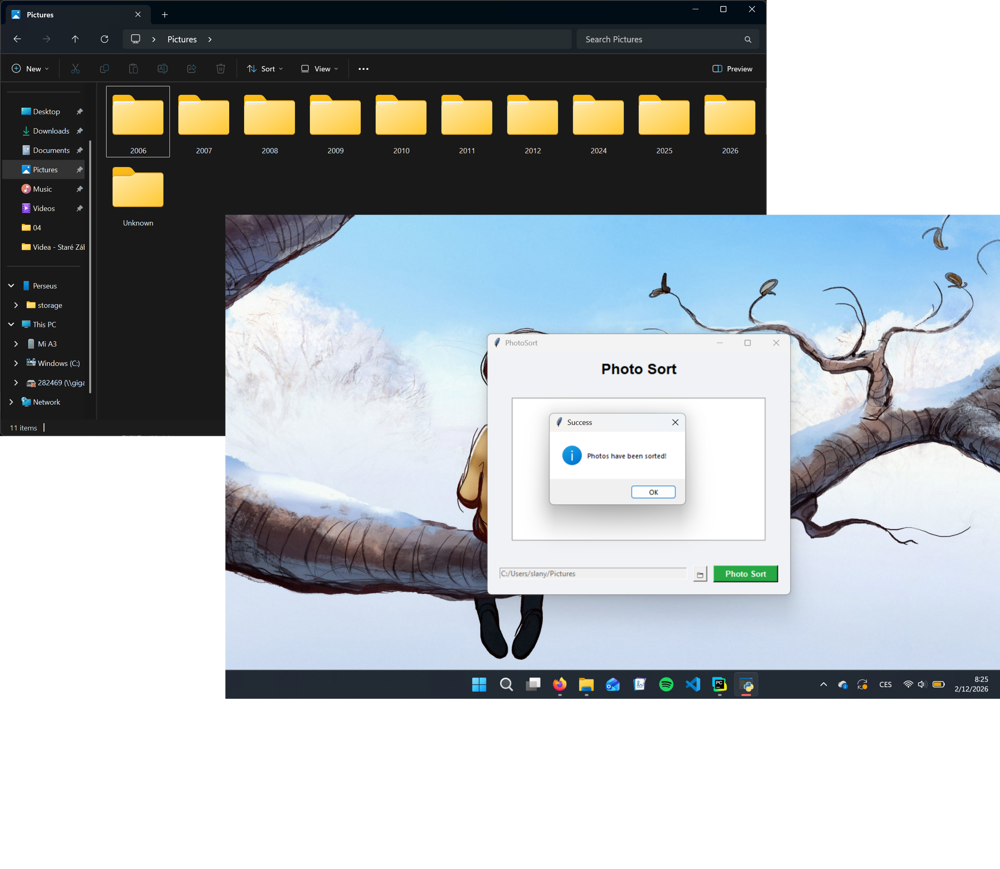
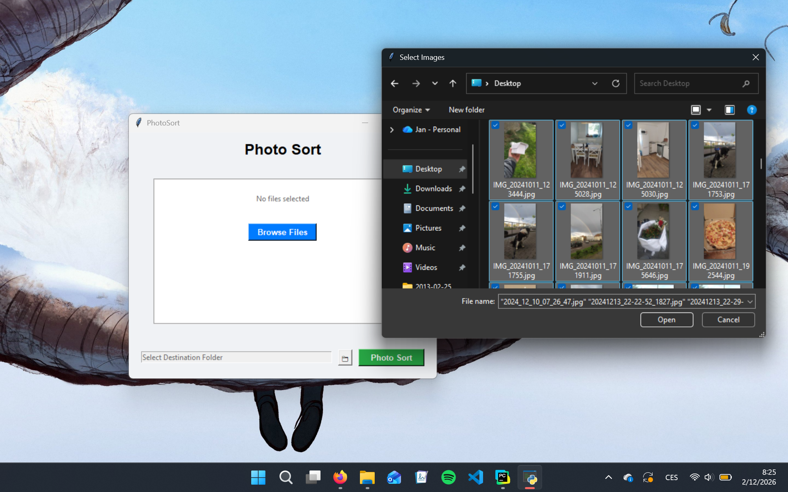

# 📸PhotoSort

Simple python GUI app for sorting photos and videos into folders by year and months.

<div align="left">
  
</div>

[](https://www.python.org)

## 📂Table of contents
- [Introduction](#introduction)
- [Getting started](#-getting-started)
- [Usage](#usage)
- [Technical details](#-technical-details)
- [Goals](#goals)

## 📑Introduction
I wrote this application to solve my problem with unorganized folders with my photos. I had many folders with photos and videos all over my laptop. It wouldn't be much of an issue. But sometimes I just want to look at old photos, which was difficult with that kind of organization. Then I was going through photos that my parents took. They were all organized in folders by year and months. That gave me an idea to make python script to sort my photos the same way.

## 🚀 Getting Started

### Installation
1. Clone the repository:
   ```bash
   git clone https://github.com/slanja/PhotoSort.git
   ```
2. Install dependencies:
   ```bash
   pip install -r requirements.txt
   ```
3. Run the application:
   ```bash
   python window.py
   ```

## ⚙️Usage
Select all photos you want to sort then select destination folder and click sort.

<div align="left">
  
</div>

## 🛠️ Technical Details
The main challenge was figuring out how to get the exact date when a photo was taken. I solved this by accessing the image metadata using the `Pillow` library.

### How it works:
* **Metadata Priority:** Since photos can have different tags, I created a priority list (`DateTimeOriginal`, `DateTimeDigitized`, `DateTime`) to find the most accurate date. If no metadata is found, the app uses the file's modification date as a fallback.
* **Smart Folders:** The app automatically creates a folder structure based on the date (e.g., `2023/10`). If a photo has no date information at all, it safely moves it to an `Unknown` folder.
* **No Overwriting:** I added a feature to handle duplicate filenames. If a file with the same name already exists in the destination, the app automatically renames the new one (e.g., `image_1.jpg`) so you never lose any data.
* **Libraries:** I used `Pillow` for EXIF data and standard Python libraries like `os` and `shutil` for moving files and creating directories.

## 🎯Goals
- add progress bar
- drag and drop
- test and debug

---
<p align="center">by Jan Slaný 🧂</p>
